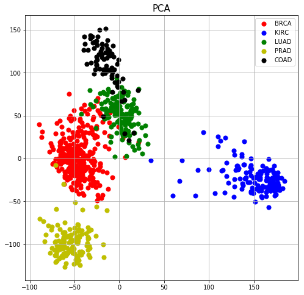
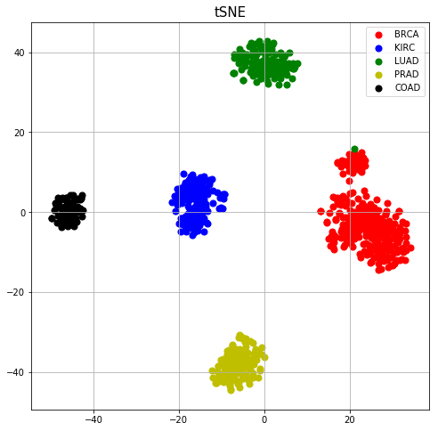

# Gene Expression
---
## Abstract
This paper provides an in-depth examination of RNA sequencing and microarray gene expression analysis techniques. The analysis encompasses data exploration, visualization, and clustering methodologies such as hierarchically-clustered heatmap, principal component analysis (PCA), and t-distributed Stochastic Neighbor Embedding (t-SNE). Additionally, the study presents a framework for cancer classification through supervised machine learning utilizing gene expression data.    

## Data
The dataset utilized for RNA-sequencing gene expression levels is a subset of the Illumina HiSeq dataset obtained from the cancer genome atlas (TCGA) pan-cancer analysis project (Weinstein, J.N. et al. 2013). It consists of 801 observations, encompassing expression levels of 20,532 genes, along with labels for five cancer types: breast (BRCA), kidney (KIRC), lung adenocarcinoma (LUAD), colon (COAD), and prostate (PRAD). The dataset was retrieved from https://archive.ics.uci.edu/dataset/401/gene+expression+cancer+rna+seq.

## Analysis
Initial analysis involved exploring the dataset through hierarchically-clustering techniques and visualizing the outcomes using a heatmap. Following this, further analysis included employing principal component analysis (PCA) and t-distributed Stochastic Neighbor Embedding (t-SNE) for visualization purposes. Additionally, the study demonstrates cancer classification methodologies through supervised machine learning algorithms applied to the gene expression data.

### Dimensionality reduction

This dataset contains gene expressions of 20532 genes, corresponding to 20532 dimensions. In order to get an intuition of the data and cluster the data without label information, a dimensionality reduction is performed using PCA and t-SNE.     

PCA was performed using 2 principal components.

t-SNE 

 

### Supervised machine learning for cancer type classification

The dataset was split 70/30, train/test dataset. 
The methods that was used was K-Nearest neighbors classifier, Support Vector Machines (SVM) and Decision Tree

Weinstein, J. N. et al. (2013), 'The Cancer Genome Atlas Pan-Cancer analysis project', Nat Genet 45 (10), 1113-1120. 

